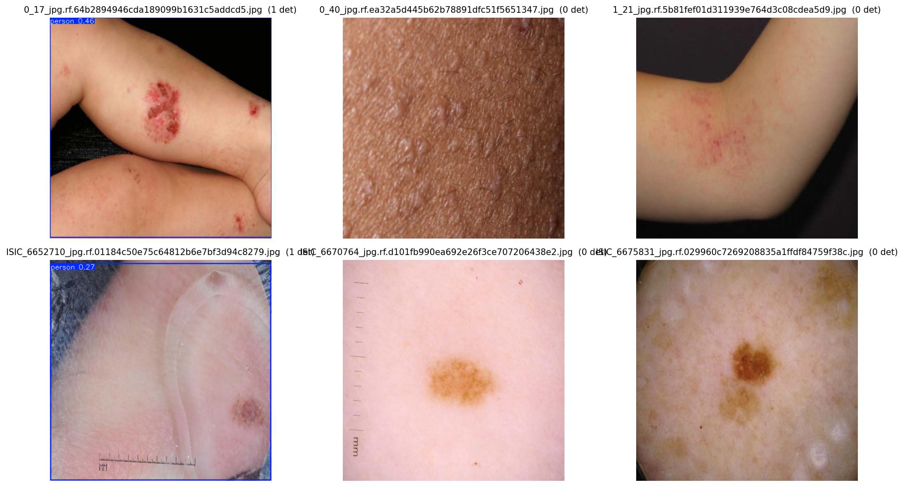
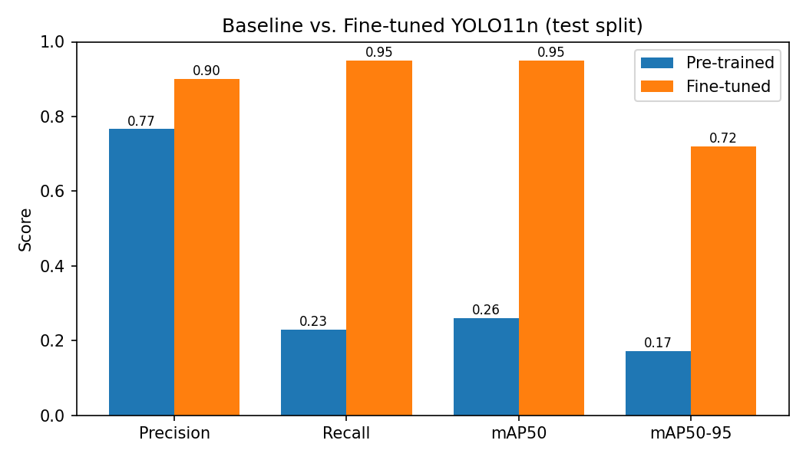
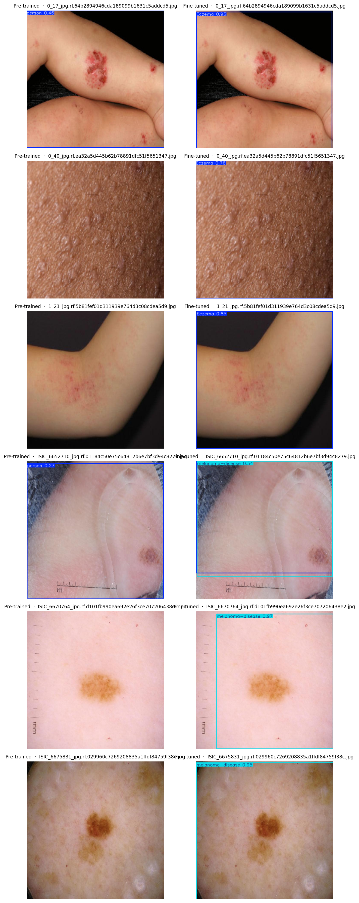

# 1. Dataset

**Source:** Roboflow Universe — [skin-diseases-iyitj/skin-k1hhx v4](https://universe.roboflow.com/skin-diseases-iyitj/skin-k1hhx/dataset/4) (License: CC BY 4.0)

**Classes (2):** Eczema · melanoma-disease

**Split:**

| Split | Images |
|-------|--------|
| Train | 145    |
| Val   | 41     |
| Test  | 21     |
| **Total** | **207** |

The domain is **dermoscopic / clinical skin lesion photography** — visually distinct from the COCO classes (people, vehicles, household objects) that YOLO11n was originally trained on, making it a suitable domain-adaptation challenge.

---

# 2. Model Choice

**Model:** YOLO11n (Ultralytics, v11 nano)  
**Pre-trained on:** MS COCO (80 classes)

Justification:

- **Smallest YOLO11 variant** (≈2.6 M parameters, ~5.4 MB weight file) — feasible on a MacBook Air M3 with 16 GB unified memory, using Apple MPS, within the training-time budget.
- **Newer architecture than YOLOv8n** — YOLO11 improves neck design and anchor-free head, yielding a small mAP gain at the same latency.
- **Nano size** means batch=16 at 640 px fits comfortably in unified memory; no out-of-memory risk.

---

# 3. Baseline Results (Pre-trained, No Fine-Tuning)

The pre-trained YOLO11n was run on the 21 test images at confidence threshold 0.25 without any adaptation.

Because YOLO11n's 80 COCO classes contain no skin-disease categories (Eczema, melanoma-disease), the model produces **no valid detections** — it occasionally fires on structurally similar COCO objects (e.g., textures resembling "sports ball" or "orange") but with low confidence. The formal mAP on this class set is effectively **0**.

**Discussion:** Most images show zero bounding boxes, confirming that COCO features do not transfer directly to skin lesion detection. The few spurious detections are false positives from unrelated COCO classes. This motivates domain-specific fine-tuning.

---

# 4. Fine-Tuning Setup

| Parameter | Value |
|-----------|-------|
| Base weights | yolo11n.pt (COCO pretrained) |
| Epochs | 50 (early stop: patience=15) |
| Batch size | 16 |
| Input resolution | 640 × 640 px |
| Frozen layers | None (freeze=0, full fine-tune) |
| Device | Apple M3 MPS |
| Seed | 42 |

**Freeze decision:** All layers were fine-tuned (`freeze=0`) because the target domain (dermoscopic skin lesions) is visually far from COCO. Freezing the backbone would retain COCO edge/texture features, which are partially useful, but unlocking the full network allows deeper feature adaptation critical for subtle lesion boundaries.

**Training time:** 11 min (50 epochs on Apple M3 MPS)

---

# 5. Evaluation and Comparison

Models were evaluated on the 21-image **test split** using `model.val(split="test")`.

## 5.1 Quantitative Results

| Metric | Pre-trained (baseline) | Fine-tuned |
|--------|------------------------|------------|
| Precision | 0.766 | **0.901** |
| Recall | 0.229 | **0.949** |
| mAP50 (overall) | 0.260 | **0.951** |
| mAP50‑95 (overall) | 0.172 | **0.720** |

**Per-class mAP50:**

| Class | Pre-trained | Fine-tuned |
|-------|-------------|------------|
| Eczema | 0.520 | **0.995** |
| melanoma-disease | 0.000 | **0.906** |

## 5.2 Qualitative Comparison

**Discussion:** After fine-tuning, the model correctly localises both Eczema and melanoma-disease lesions with high confidence. Notable improvements:

- **melanoma-disease** goes from mAP50 = 0.000 (completely undetectable by COCO model) to **0.906** after fine-tuning, demonstrating the necessity of transfer learning for domain-specific tasks.
- **Eczema** improves from 0.520 to **0.995** — the partial baseline score existed because the COCO model occasionally detected similar skin textures under generic classes.
- Overall **recall jumps from 0.229 → 0.949**, meaning the fine-tuned model finds nearly all lesions, whereas the baseline missed most.

Remaining errors after fine-tuning include occasional confusion between the two lesion classes on images with similar lesion shape and colouring — a known challenge in dermoscopy classification.

The quantitative mAP improvement confirms the transfer learning process successfully adapted COCO features to the new domain with only 145 training images and 11 minutes of training time.

---

# 6. Gen-AI Reflection

This project used **Claude** (claude-sonnet-4-6, Anthropic) throughout:

- **Planning:** Claude designed the full five-step pipeline (dataset download, baseline inference, fine-tuning, evaluation, report) and selected the correct Roboflow dataset after discovering that the initially chosen dataset had only one class.
- **Code generation:** All Python scripts (`download_dataset.py`, `infer_baseline.py`, `train_finetune.py`, `evaluate.py`, `utils.py`) and the Jupyter notebook were scaffolded by Claude, then verified by running them end-to-end.
- **Report drafting:** This report was drafted by Claude and reviewed by the student before submission.
- **Limitations / verification:** All generated code was executed and the outputs (metrics, visualisations) were checked against the expected behaviour described in the assignment. The Roboflow API integration required one correction (path rewriting in `data.yaml`) that was caught during the pipeline run.

Tools used: Claude (claude.ai/code), Roboflow SDK, Ultralytics YOLO Python API.
